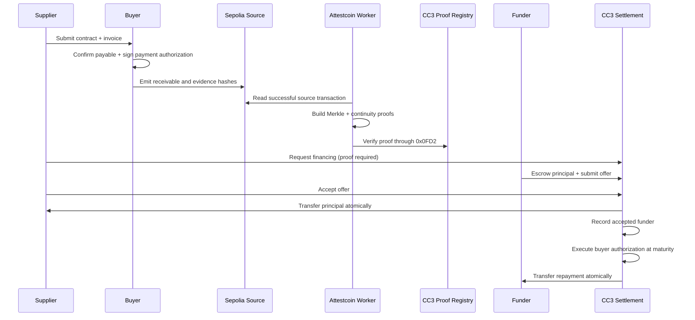
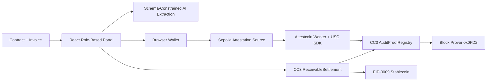

# AttestFlow

> Turn buyer-approved invoices into verifiable, financeable cash flow.

**RWA Track | Creditcoin CC3 + Attestcoin | End-to-end testnet prototype**

[Run locally](#run-locally) | [Verify contracts](#live-testnet-deployments)


## The 30-Second Pitch

Small suppliers routinely wait 30 to 120 days after delivery, while funders hesitate because an invoice PDF does not prove buyer approval, unique ownership, or who should receive repayment.

AttestFlow turns a buyer-confirmed receivable into a verifiable financing workflow:

1. AI extracts structured facts from the contract and invoice.
2. The buyer confirms the payable and signs a future-valid EIP-3009 payment authorization.
3. Attestcoin proves the buyer's Sepolia attestation on Creditcoin CC3.
4. Only a proven receivable can request financing.
5. A funder escrows principal; acceptance pays the supplier atomically.
6. At maturity, the buyer's authorization repays that exact funder in one transaction.

**Suppliers receive working capital sooner. Funders underwrite the buyer with independently verifiable evidence. Buyers approve once instead of returning to sign again at maturity.**

## Why This Can Win

Supply-chain finance has a trust coordination problem, not merely a tokenization problem.

| Broken today | AttestFlow |
| --- | --- |
| Trade documents are manually reconciled across disconnected systems | AI extracts and cross-checks structured commercial facts |
| A database flag saying "approved" cannot be independently verified | The buyer publishes a source-chain attestation proven through Attestcoin |
| The same invoice can be presented to multiple funders | A deterministic receivable ID and on-chain state prevent duplicate financing |
| Financing offers may not be backed by committed liquidity | The funder's principal is escrowed when the offer is submitted |
| Repayment depends on manual operations at maturity | A one-time EIP-3009 authorization enables bounded, replay-protected settlement |
| Repayment can reach the wrong party after assignment | The contract pays only the accepted funder recorded for that receivable |

AttestFlow does not tokenize paperwork for its own sake. It connects the real-world source, buyer approval, financing ownership, and eventual cash flow into one auditable lifecycle.

## Why This Is a Real RWA Protocol

The asset is a payment claim created by an actual commercial relationship: a supplier delivers goods or services, an enterprise buyer confirms the payable, and a funder advances capital against that future payment.

| RWA requirement | AttestFlow implementation |
| --- | --- |
| Real-world origin | Contract, invoice, supplier, buyer, amount, and maturity date |
| Privacy-preserving evidence | Documents remain off-chain; deterministic hashes bind the workflow |
| Independently verifiable fact | Attestcoin proves the successful buyer attestation from Sepolia on CC3 |
| Financing ownership | The accepted funder is recorded in `ReceivableSettlement` |
| Capital movement | Escrow-backed offer and atomic supplier disbursement |
| Asset cash flow | Buyer-authorized EIP-3009 repayment at maturity |
| Auditability | Source receipt, proof record, contract state, events, and replay protection |
| Legal boundary | The protocol records and executes the workflow; the underlying agreement creates the claim |

## End-to-End Solution



### A complete working flow

1. **Document intelligence** - The supplier uploads a contract and invoice. PDF text is extracted locally, while the configured AI model returns structured trade facts using a constrained JSON schema.
2. **Buyer confirmation** - The buyer reviews the payable and signs an EIP-712/EIP-3009 authorization tied to the amount, token, settlement contract, validity window, and unique nonce.
3. **Verifiable evidence** - The buyer publishes the receivable and authorization hash through a Sepolia source contract. A worker builds an Attestcoin inclusion proof, and `AuditProofRegistry` verifies the successful source event on Creditcoin.
4. **On-chain financing** - The supplier publishes a financing request. A funder escrows stablecoins with an offer; acceptance releases the principal directly to the supplier.
5. **Atomic repayment** - At maturity, an authorized relayer submits the buyer's one-time authorization. The settlement contract pulls funds and transfers them directly to the accepted funder in the same transaction.

## Why It Is Different

| Typical invoice-finance demo | AttestFlow |
| --- | --- |
| Uploads an invoice and mints a token | Verifies trade data, buyer approval, financing, and settlement as one lifecycle |
| Requires the buyer to pre-fund or lock capital | Uses a future-valid one-time authorization; no funds are locked at approval |
| Stores financing state in an application database | Escrows the offer and records ownership-critical state in a smart contract |
| Sends repayment to a hard-coded wallet | Pays the accepted funder recorded for that receivable |
| Treats AI output as truth | Uses AI for extraction, then relies on signatures, hashes, and on-chain state for trust |
| Demonstrates a happy-path transfer | Prevents replay, duplicate settlement, unauthorized relaying, and reentrancy |

## Core Innovation

### 1. Approval now, payment later

The buyer signs a standard `TransferWithAuthorization` message when approving the payable. Its `validAfter` can begin at maturity, while `validBefore` defines a bounded settlement window. The authorization is specific to one token, amount, destination contract, chain, and nonce.

This separates **legal/commercial approval** from **cash movement** without requiring the buyer to return and sign another transaction on the due date.

> A payment authorization is not a payment guarantee. It does not lock the buyer's funds. AttestFlow makes this boundary explicit and treats insufficient balance as buyer credit risk, not protocol certainty.

### 2. Financing and repayment share one source of truth

`ReceivableSettlement` links each receivable hash to its supplier, accepted funder, principal, face value, and settlement state. The funder escrows the financing principal before presenting an offer. Once accepted, the supplier receives funds immediately and the accepted funder becomes the only valid settlement recipient.

### 3. Evidence without exposing documents

Commercial files remain off-chain. AttestFlow proves a Sepolia event containing the receivable and evidence hashes, while `AuditProofRegistry` validates the transaction receipt, source contract, buyer, event fields, and replay key without publishing sensitive trade documents.

## RWA Track Fit

| What judges are looking for | What AttestFlow demonstrates |
| --- | --- |
| Tokenize, manage, or finance real-world assets | Finances buyer-confirmed receivables and records the accepted funder's economic interest |
| Bridge off-chain value on-chain | Converts trade-document facts and buyer approval into a deterministic receivable identity and executable payment terms |
| Practical financial utility | Gives suppliers early stablecoin liquidity against future enterprise payments |
| Transparent lifecycle | Exposes financing request, escrowed offer, acceptance, and direct settlement through contract state and events |
| Credible risk model | Treats buyer non-payment as credit risk; never describes an unlocked authorization as guaranteed funds |
| Testnet execution | Core financing, evidence registry, and settlement contracts are deployed on Creditcoin CC3 |

## Live Testnet Deployments

The current prototype is configured for the complete Sepolia-to-Creditcoin proof path:

| Network | Contract | Address |
| --- | --- | --- |
| Ethereum Sepolia | `ReceivableAttestationSource` | [`0xf7eb...b3a0`](https://sepolia.etherscan.io/address/0xf7eb1a5b702fa7593203587fbf8781a78b1bb3a0) |
| Creditcoin CC3 | `AuditProofRegistry` | [`0x9f0f...34f6`](https://creditcoin-testnet.blockscout.com/address/0x9f0f7b1e0615e27ca59f49240256bf25e88634f6) |
| Creditcoin CC3 | `ReceivableSettlement` | [`0xe722...74be`](https://creditcoin-testnet.blockscout.com/address/0xe722de8262d9a7af778dd6a03969610d0d3774be) |
| Creditcoin CC3 | `MockUSDC` | [`0xf40e...56A3`](https://creditcoin-testnet.blockscout.com/address/0xf40eAB52058b666De01f73fEa92a5623173A56A3) |

**Creditcoin CC3 Testnet:** chain ID `102031` | [Blockscout explorer](https://creditcoin-testnet.blockscout.com)

`MockUSDC` is a six-decimal demonstration asset with EIP-3009 support. It is not production USDC and has no monetary claim.

## Attestcoin Integration

The repository now implements the Attestcoin Readability path using `@gluwa/usc-sdk` and `@gluwa/usc-contracts`. The buyer emits `ReceivableAttested` on Ethereum Sepolia, the local worker waits for attestation and builds Merkle and continuity proofs, and the CC3 registry verifies them through Block Prover precompile `0x0FD2` before financing is allowed.

```mermaid
flowchart LR
    SOURCE[Sepolia ReceivableAttested event] --> WORKER[Readability worker]
    WORKER --> WAIT[Wait for Creditcoin attestation]
    WAIT --> SDK[ProofBuilder via @gluwa/usc-sdk]
    SDK --> PROOF[Merkle + continuity proof]
    PROOF --> ASC[AuditProofRegistry on CC3]
    ASC --> PRECOMPILE[Block Prover Precompile 0x0FD2]
    PRECOMPILE --> GATE[Enable requestFinancing]
```



`AuditProofRegistry` accepts submissions only from its relayer owner, but the relayer cannot bypass proof verification. It checks transaction success, Sepolia chain key, source contract, event signature, receivable hash, evidence hash, buyer address, and replay state. `ReceivableSettlement.requestFinancing` then checks `isVerified` before recording a financing request.

Official references: [Attestcoin SDK](https://docs.creditcoin.org/attestcoin-protocol/dapp-builder-infrastructure/attestcoin-sdk-usc-sdk) · [Chains and environments](https://docs.creditcoin.org/attestcoin-protocol/attestcoin-protocol-chains-environments) · [Guided tutorials](https://docs.creditcoin.org/attestcoin-protocol/guided-tutorials)

## Smart Contract Design

### `ReceivableAttestationSource.sol`

- Emits buyer-bound `ReceivableAttested` events on Sepolia
- Rejects empty receivable and evidence hashes
- Provides the external fact later proven on Creditcoin

### `ReceivableSettlement.sol`

- On-chain financing requests and escrow-backed offers
- Supplier-only offer acceptance
- EIP-3009 `transferWithAuthorization` settlement
- Receivable-level and authorization-level replay protection
- Atomic authorization settlement and direct funder transfer
- Token allowlist and restricted settlement operators
- `Pausable`, `ReentrancyGuard`, `SafeERC20`, and checks-effects-interactions

### `AuditProofRegistry.sol`

- One immutable proof per receivable
- Merkle and continuity verification through precompile `0x0FD2`
- Successful receipt and source-event decoding
- Owner-relayed proof submission with no trusted hash-write bypass
- Source-query replay protection
- Timestamped, event-indexed audit records

### `MockUSDC.sol`

- Six-decimal test asset for the CC3 demo
- EIP-3009-compatible authorization execution
- Used only for testnet demonstration, never presented as production USDC

## Architecture



The prototype keeps sensitive documents and business metadata off-chain. The chain stores only the evidence commitments and state needed to verify financing eligibility, ownership, authorization use, and settlement.

## Judge Demo Path

The interface provides dedicated **Supplier**, **Buyer**, **Funder**, and **Operator** workspaces. A complete demo takes only a few minutes:

1. **Supplier:** import the included contract and invoice samples; review AI-extracted terms and create the receivable.
2. **Buyer:** confirm the payable, connect a wallet, and sign the EIP-3009 authorization.
3. **Buyer / Operator:** publish the Sepolia attestation and watch proof status move through `queued`, `waiting_attestation`, `building`, `submitting`, and `verified`.
4. **Supplier:** request financing after the CC3 registry verifies the proof.
5. **Funder:** approve mUSDC and submit an escrow-backed offer.
6. **Supplier:** accept the offer and observe immediate on-chain disbursement.
7. **Operator:** execute settlement and confirm direct repayment to the accepted funder.
8. Open the transaction links and contract state shown in the UI to verify each claim independently.

For presentation mode, `PAYMENT_AUTH_DEMO_MODE=true` makes the authorization immediately valid so judges do not need to wait for the invoice maturity date.

## Technology

| Layer | Stack |
| --- | --- |
| Source chain | Ethereum Sepolia |
| Proof and settlement chain | Creditcoin CC3 Testnet (`102031`) |
| Cross-chain verification | Attestcoin, `@gluwa/usc-sdk`, `@gluwa/usc-contracts` |
| Contracts | Solidity, OpenZeppelin Contracts |
| Payments | EIP-712 typed data, EIP-3009 `TransferWithAuthorization` |
| Web app | React 19, TypeScript, Vite |
| Wallets | wagmi, viem, RainbowKit |
| Documents | PDF.js, schema-constrained AI extraction |
| Persistence | Server-side JSON stores for prototype business metadata |

## Risk and Trust Boundaries

AttestFlow is designed around explicit claims rather than implied guarantees:

- The buyer's signature proves authorization, not future wallet solvency.
- AI extracts and compares document facts; it does not approve credit or establish legal validity.
- Hashes prove data integrity after registration; they do not prove that the original document was truthful.
- `MockUSDC` is a test asset and has no claim on production USDC.
- The demo receivable and sample documents are fictional and create no payment obligation.
- A production launch requires enforceable assignment agreements, KYB/AML controls, audited contracts, secure key management, and jurisdiction-specific legal review.

## Run Locally

### Prerequisites

- Node.js 20+
- A browser wallet
- Creditcoin CC3 testnet CTC for gas
- Ethereum Sepolia ETH for the source-contract deployment and buyer transaction
- Optional: an OpenAI-compatible model endpoint for document extraction

```bash
cd app
npm install
copy .env.example .env.local
npm run dev
```

Open the local URL printed by Vite. The included sample PDFs allow the workflow to be demonstrated without preparing external documents.

To run the contract checks and verify the production build:

```bash
npm test
npm run build
```

To validate Attestcoin support and deploy the dual-chain contracts:

```bash
npm run contracts:compile
npm run attestcoin:check
npm run deploy:sepolia:prepare
# Fund the generated deployer with Sepolia ETH, then:
npm run deploy:sepolia
npm run deploy:cc3:prepare
# Fund the generated deployer with testnet CTC, then:
npm run deploy:cc3
```

Deployment keys are stored in the git-ignored `.env.deploy.local`. Never place private keys in `.env.local` or commit them.

## Repository Guide

| Path | Purpose |
| --- | --- |
| [`app/src/App.tsx`](app/src/App.tsx) | Role-based product experience and complete demo workflow |
| [`app/vite.config.ts`](app/vite.config.ts) | Document AI, persistence, authorization verification, proof worker, and relayer APIs |
| [`app/contracts/ReceivableAttestationSource.sol`](app/contracts/ReceivableAttestationSource.sol) | Sepolia source event |
| [`app/contracts/AuditProofRegistry.sol`](app/contracts/AuditProofRegistry.sol) | Attestcoin proof verification and eligibility registry |
| [`app/contracts/ReceivableSettlement.sol`](app/contracts/ReceivableSettlement.sol) | Financing, escrow, disbursement, and settlement |
| [`app/src/paymentAuthorization.ts`](app/src/paymentAuthorization.ts) | EIP-3009 typed-data construction |
| [`app/tests/contracts.test.mjs`](app/tests/contracts.test.mjs) | Contract ABI and proof-gate tests |

## Scope: Built vs Next

**Built in the hackathon prototype:** document extraction, buyer authorization, Sepolia source attestation, Attestcoin proof construction, CC3 proof verification, proof-gated financing, escrow-backed offer, atomic supplier funding, and direct funder repayment.

**Next toward production:** transactional persistence, enterprise identity and KYB/AML, HSM-backed relayers, event indexing, production stablecoin validation, contract audit, legal structuring, supplier hold-to-maturity, and multi-funder allocation.

## Vision

AttestFlow turns an approved invoice from a static document into programmable financial infrastructure: **AI-readable, buyer-authorized, independently verifiable, funder-financeable, and automatically settleable.**

We are not tokenizing paperwork for its own sake. We are building the trust and payment rails that let real businesses convert approved revenue into working capital.