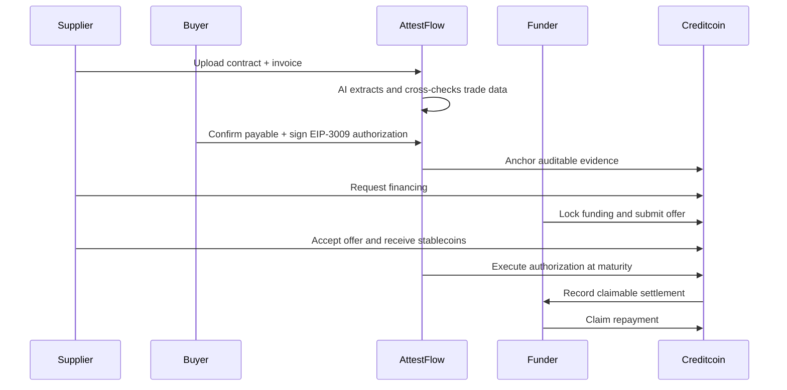
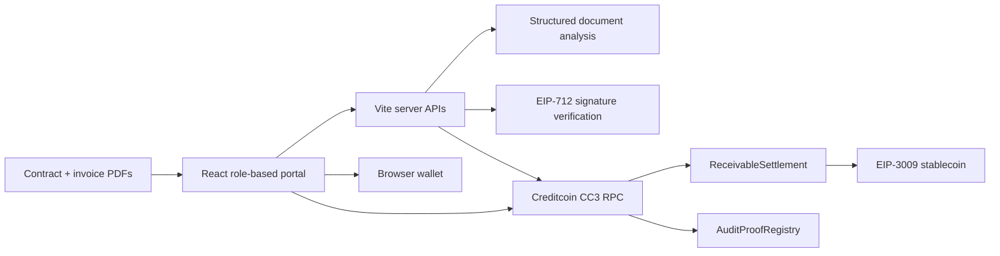

# AttestFlow

### Turn approved invoices into programmable, financeable cash flow.

**RWA Track · Creditcoin CC3 Testnet**

AttestFlow is an AI-assisted **real-world asset financing protocol** built on Creditcoin CC3. It transforms a buyer-confirmed trade receivable into a privacy-preserving digital RWA whose evidence, financing ownership, and settlement lifecycle can be independently audited. It connects real trade documents, non-recourse stablecoin financing, and one-time **EIP-3009** payment authorizations in a single workflow.

The result: suppliers receive working capital before an invoice matures, funders underwrite the buyer rather than the supplier, and settlement can execute on-chain without asking the buyer to sign again at maturity.


## Live on Creditcoin CC3

The protocol is deployed and independently verifiable on the Creditcoin testnet:

| Contract | Deployment |
| --- | --- |
| `ReceivableSettlement` | [`0x19b0...edf8`](https://creditcoin-testnet.blockscout.com/address/0x19b0719a78963ff367e18fcdeeff50542667edf8) |
| `AuditProofRegistry` | [`0xe211...7c94`](https://creditcoin-testnet.blockscout.com/address/0xe211141c75a8037cd7943fc0f069fc9219e67c94) |
| `MockUSDC` (demo asset) | [`0xf40e...6A3`](https://creditcoin-testnet.blockscout.com/address/0xf40eAB52058b666De01f73fEa92a5623173A56A3) |

**Network:** Creditcoin CC3 Testnet · **Chain ID:** `102031` · **Explorer:** [Blockscout](https://creditcoin-testnet.blockscout.com)

## Submission Snapshot

| Field | Details |
| --- | --- |
| Project | **AttestFlow** |
| Track | **RWA** |
| RWA type | Buyer-confirmed trade receivables |
| Users | Suppliers, enterprise buyers, and funders |
| Testnet | Creditcoin CC3 (`102031`) |
| Repository | [github.com/skymiss18/supplychain](https://github.com/skymiss18/supplychain) |
| Prototype status | End-to-end testnet workflow |

## Why This Is an RWA Project

The financed asset is not a synthetic token or crypto-native position. It is a **payment claim created by a real commercial relationship**: a supplier delivers goods or services, an enterprise buyer confirms the resulting payable, and a funder advances capital against that receivable.

AttestFlow bridges that off-chain value on-chain without publishing confidential contracts or pretending that a token alone creates legal enforceability:

| RWA layer | AttestFlow representation |
| --- | --- |
| Asset origin | Contract, invoice, buyer, supplier, amount, and maturity date |
| Evidence | Hash-linked commercial data and buyer-signed payment terms |
| Digital identity | Deterministic `receivableIdHash` for every receivable |
| Ownership | Accepted funder recorded in `ReceivableSettlement` |
| Financing | Escrow-backed stablecoin offer and on-chain supplier disbursement |
| Cash flow | Buyer-authorized EIP-3009 settlement at maturity |
| Auditability | Contract events, transaction receipts, replay protection, and evidence commitments |
| Legal boundary | On-chain records evidence and execute the workflow; they do not replace the underlying contract |

This design addresses the central RWA challenge: making an off-chain claim **verifiable and financeable on-chain while preserving the link to its real-world source and cash flow**.

## The Problem

Small suppliers often wait 30-120 days to be paid, even after delivery has been accepted. Traditional invoice financing is still slowed down by three disconnected trust problems:

- **Is the trade real?** Contracts and invoices are reviewed manually and live in separate systems.
- **Has the buyer approved the debt?** A PDF or database status is difficult for a funder to verify independently.
- **Who gets paid at maturity?** Financing and settlement records are fragmented, creating reconciliation and double-financing risk.

Putting an invoice hash on-chain does not solve these problems by itself. AttestFlow connects the evidence, approval, financing, payment authorization, and final cash movement.

## Our Solution



### A complete working flow

1. **Document intelligence** - The supplier uploads a contract and invoice. PDF text is extracted locally, while the configured AI model returns structured trade facts using a constrained JSON schema.
2. **Buyer confirmation** - The buyer reviews the payable and signs an EIP-712/EIP-3009 authorization tied to the amount, token, settlement contract, validity window, and unique nonce.
3. **Verifiable evidence** - AttestFlow verifies the signature server-side and can register immutable evidence hashes in the `AuditProofRegistry` on Creditcoin.
4. **On-chain financing** - The supplier publishes a financing request. A funder escrows stablecoins with an offer; acceptance releases the principal directly to the supplier.
5. **Atomic settlement** - At maturity, an authorized relayer submits the buyer's one-time authorization. The settlement contract pulls funds and assigns them to the current funder in the same transaction.
6. **Final claim** - The funder claims the settlement balance on-chain, completing the receivable lifecycle.

## Why It Is Different

| Typical invoice-finance demo | AttestFlow |
| --- | --- |
| Uploads an invoice and mints a token | Verifies trade data, buyer approval, financing, and settlement as one lifecycle |
| Requires the buyer to pre-fund or lock capital | Uses a future-valid one-time authorization; no funds are locked at approval |
| Stores financing state in an application database | Escrows the offer and records ownership-critical state in a smart contract |
| Sends repayment to a hard-coded wallet | Pays the accepted funder recorded for that receivable |
| Treats AI output as truth | Uses AI for extraction, then relies on signatures, hashes, and on-chain state for trust |
| Demonstrates a happy-path transfer | Prevents replay, duplicate settlement, unauthorized relaying, and reentrancy |

## Core Innovation

### 1. Approval now, payment later

The buyer signs a standard `TransferWithAuthorization` message when approving the payable. Its `validAfter` can begin at maturity, while `validBefore` defines a bounded settlement window. The authorization is specific to one token, amount, destination contract, chain, and nonce.

This separates **legal/commercial approval** from **cash movement** without requiring the buyer to return and sign another transaction on the due date.

> A payment authorization is not a payment guarantee. It does not lock the buyer's funds. AttestFlow makes this boundary explicit and treats insufficient balance as buyer credit risk, not protocol certainty.

### 2. Financing and repayment share one source of truth

`ReceivableSettlement` links each receivable hash to its supplier, accepted funder, principal, face value, and settlement state. The funder escrows the financing principal before presenting an offer. Once accepted, the supplier receives funds immediately and the accepted funder becomes the only valid settlement recipient.

### 3. Evidence without exposing documents

Commercial files remain off-chain. AttestFlow anchors hashes of the receivable, source transaction, and supporting evidence in `AuditProofRegistry`, creating an immutable verification trail without publishing sensitive trade documents.

## RWA Track Fit

| What judges are looking for | What AttestFlow demonstrates |
| --- | --- |
| Tokenize, manage, or finance real-world assets | Finances buyer-confirmed receivables and records the accepted funder's economic interest |
| Bridge off-chain value on-chain | Converts trade-document facts and buyer approval into a deterministic receivable identity and executable payment terms |
| Practical financial utility | Gives suppliers early stablecoin liquidity against future enterprise payments |
| Transparent lifecycle | Exposes financing request, escrowed offer, acceptance, settlement, and claim through contract state and events |
| Credible risk model | Treats buyer non-payment as credit risk; never describes an unlocked authorization as guaranteed funds |
| Testnet execution | Core financing, evidence registry, and settlement contracts are deployed on Creditcoin CC3 |

## Attestcoin Protocol Integration Status

AttestFlow's current prototype runs its business logic on Creditcoin CC3 and includes an application-level evidence pipeline: it discovers a real `FinancingRequested` transaction, combines its transaction and block hashes with the buyer's authorization hash, and records the resulting commitment in `AuditProofRegistry`.

That pipeline is useful audit infrastructure, but it is **not yet a complete integration with the official Attestcoin Protocol**. A complete Attestcoin readability integration must prove a transaction from a supported external source chain using the official SDK and verify its Merkle and continuity proofs through Creditcoin's Block Prover Precompile.

### Required Attestcoin path

```mermaid
flowchart LR
    SOURCE[Supported source chain event] --> WORKER[Readability worker]
    WORKER --> WAIT[Wait for Creditcoin attestation]
    WAIT --> SDK[ProofBuilder via @gluwa/usc-sdk]
    SDK --> PROOF[Merkle + continuity proof]
    PROOF --> ASC[Attestcoin Smart Contract on CC3]
    ASC --> PRECOMPILE[Block Prover Precompile 0x0FD2]
    PRECOMPILE --> LOGIC[Update receivable eligibility or settlement logic]
```



For AttestFlow, the intended source event is an externally confirmed trade or payment event on a supported chain. After inclusion and continuity verification, the Attestcoin Smart Contract would decode the successful transaction, enforce replay protection, and make that verified fact available to the RWA financing workflow.

The official integration therefore requires these additional deliverables before submission:

1. Install `@gluwa/usc-sdk` and its `ethers` v6 peer dependency.
2. Query the supported source-chain `chainKey` with `PrecompileChainInfoProvider`.
3. Wait for attestation and generate the proof with `ProofBuilder`.
4. Verify the proof on Creditcoin using `PrecompileBlockProver` or an ASC calling precompile `0x0FD2`.
5. Validate source transaction success and expected event contents before changing RWA state.
6. Publish source and CC3 transaction links as reproducible evidence.

Official references: [Attestcoin SDK](https://docs.creditcoin.org/attestcoin-protocol/dapp-builder-infrastructure/attestcoin-sdk-usc-sdk) · [Chains and environments](https://docs.creditcoin.org/attestcoin-protocol/attestcoin-protocol-chains-environments) · [Guided tutorials](https://docs.creditcoin.org/attestcoin-protocol/guided-tutorials)

## Smart Contract Design

### `ReceivableSettlement.sol`

- On-chain financing requests and escrow-backed offers
- Supplier-only offer acceptance
- EIP-3009 `transferWithAuthorization` settlement
- Receivable-level and authorization-level replay protection
- Pull-based funder claims
- Token allowlist and restricted settlement operators
- `Pausable`, `ReentrancyGuard`, `SafeERC20`, and checks-effects-interactions

### `AuditProofRegistry.sol`

- One immutable proof per receivable
- Evidence and source-transaction hashes
- Owner-controlled registration
- Timestamped, event-indexed audit records

### `MockUSDC.sol`

- Six-decimal test asset for the CC3 demo
- EIP-3009-compatible authorization execution
- Used only for testnet demonstration, never presented as production USDC

## Architecture



The prototype deliberately keeps sensitive documents and business metadata off-chain while placing settlement-critical ownership, authorization use, and payment state on-chain.

## Judge Demo Path

The interface provides dedicated **Supplier**, **Buyer**, and **Funder** workspaces. A complete demo takes only a few minutes:

1. Open the **Supplier** workspace and create a receivable from the included sample contract and invoice PDFs.
2. Switch to **Buyer**, review the extracted payable, connect a browser wallet, and sign the payment authorization.
3. Return as **Supplier** and publish the financing request to Creditcoin CC3.
4. Switch to **Funder**, approve mUSDC, and submit an escrow-backed offer.
5. As **Supplier**, accept the offer and observe the on-chain disbursement.
6. Trigger settlement with the verified authorization, then claim the repayment as **Funder**.
7. Inspect transaction hashes, contract events, authorization status, and the audit-proof timeline in the interface.

For presentation mode, `PAYMENT_AUTH_DEMO_MODE=true` makes the authorization immediately valid so judges do not need to wait for the invoice maturity date.

## Technology

| Layer | Stack |
| --- | --- |
| Network | Creditcoin CC3 Testnet, chain ID `102031` |
| Contracts | Solidity `0.8.24`, OpenZeppelin Contracts |
| Payments | EIP-712 typed data, EIP-3009 `TransferWithAuthorization` |
| Web app | React 19, TypeScript, Vite |
| Wallets | wagmi, viem, RainbowKit |
| Documents | PDF.js, schema-constrained AI extraction |
| Persistence | Server-side JSON stores for prototype business metadata |

## Risk and Trust Boundaries

AttestFlow is designed around explicit claims rather than implied guarantees:

- The buyer's signature proves authorization, not future wallet solvency.
- AI extracts and compares document facts; it does not approve credit or establish legal validity.
- Hashes prove data integrity after registration; they do not prove that the original document was truthful.
- `MockUSDC` is a test asset and has no claim on production USDC.
- The demo receivable and sample documents are fictional and create no payment obligation.
- A production launch requires enforceable assignment agreements, KYB/AML controls, audited contracts, secure key management, and jurisdiction-specific legal review.

## Run Locally

### Prerequisites

- Node.js 20+
- A browser wallet
- Creditcoin CC3 testnet CTC for gas
- Optional: an OpenAI-compatible model endpoint for document extraction

```bash
cd app
npm install
copy .env.example .env.local
npm run dev
```

Open the local URL printed by Vite. The included sample PDFs allow the workflow to be demonstrated without preparing external documents.

To verify the production build:

```bash
npm run build
```

To compile and deploy fresh CC3 demo contracts:

```bash
npm run contracts:compile
npm run deploy:cc3:prepare
# Fund the generated deployer with testnet CTC, then:
npm run deploy:cc3
```

Deployment keys are stored in the git-ignored `.env.deploy.local`. Never place private keys in `.env.local` or commit them.

## Repository Guide

| Path | Purpose |
| --- | --- |
| [`app/src/App.tsx`](app/src/App.tsx) | Role-based product experience and complete demo workflow |
| [`app/vite.config.ts`](app/vite.config.ts) | Document AI, persistence, signature verification, relaying, and audit APIs |
| [`app/contracts/ReceivableSettlement.sol`](app/contracts/ReceivableSettlement.sol) | Financing and authorized settlement protocol |
| [`app/contracts/AuditProofRegistry.sol`](app/contracts/AuditProofRegistry.sol) | Immutable receivable evidence registry |
| [`app/src/paymentAuthorization.ts`](app/src/paymentAuthorization.ts) | EIP-3009 typed-data construction |
| [`design.md`](design.md) | Product, risk, state-machine, and production architecture design |

## From Prototype to Production

The hackathon build proves the hardest integration points end to end. The production path is clear:

- Replace local JSON persistence with a transactional database and indexed chain events.
- Add enterprise identity, KYB/AML checks, approval policies, and HSM-backed relayer keys.
- Add buyer balance monitoring, maturity alerts, retries, and exception workflows.
- Integrate production stablecoins only on networks where the exact authorization semantics are verified.
- Complete independent contract audits, legal structuring, and jurisdiction-specific receivables controls.

## Vision

AttestFlow turns a confirmed invoice from a static document into a programmable financial workflow: **AI-readable, buyer-authorized, funder-financeable, automatically settleable, and independently auditable.**

We are not tokenizing paperwork for its own sake. We are building the trust and payment rails that let real businesses convert approved revenue into working capital.