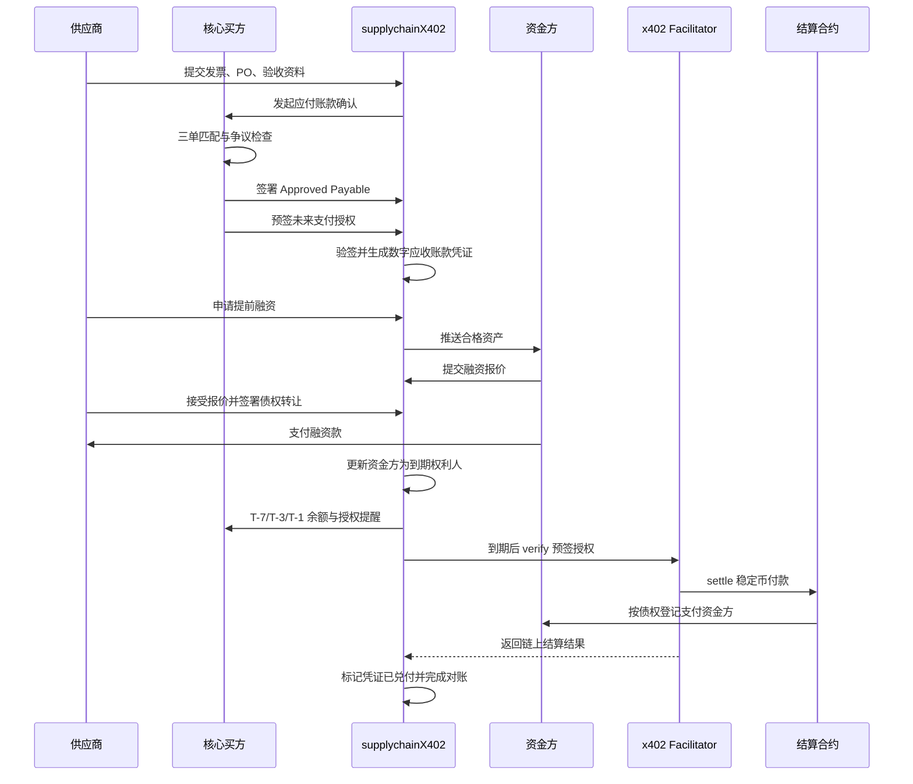
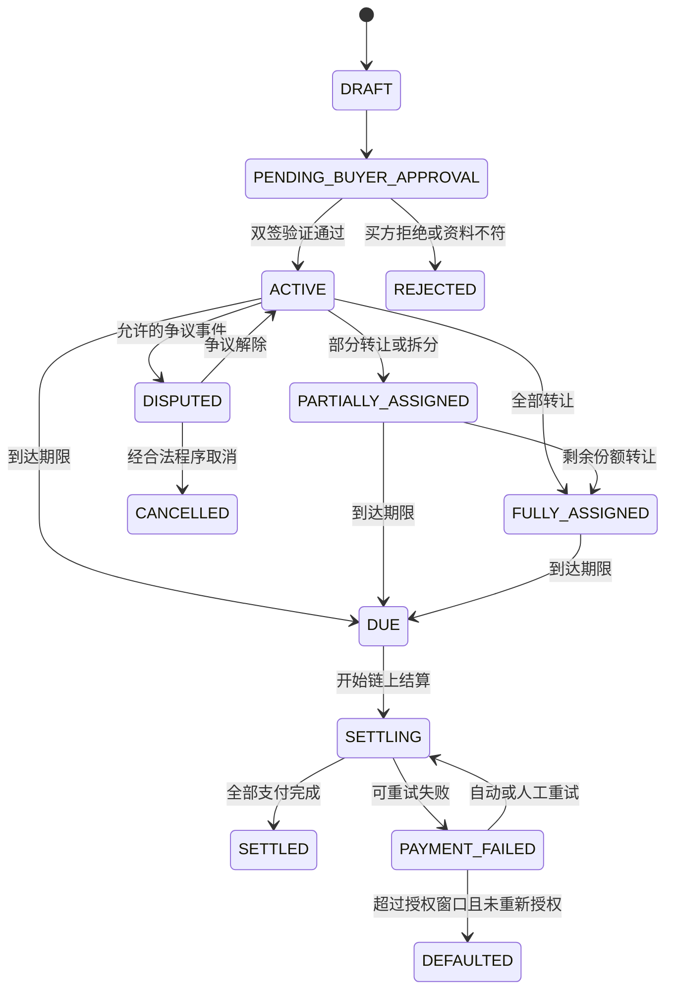
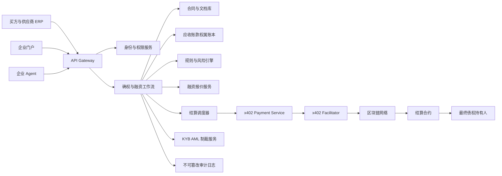
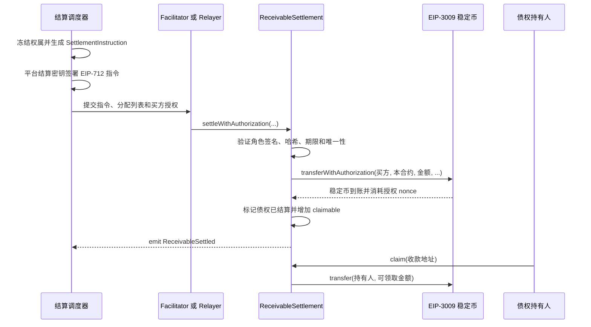

# supplychainX402 产品设计文档

## 1. 文档信息

| 项目 | 内容 |
| --- | --- |
| 产品名称 | supplychainX402 |
| 产品定位 | 基于买方确权、数字应收账款凭证和 x402 延期结算授权的供应链金融平台 |
| 设计方案 | 方案 A：买方预签未来支付授权，资金不提前锁定 |
| 文档版本 | 0.3 |
| 文档日期 | 2026-08-22 |
| 目标阶段 | 封闭式 MVP |

## 2. 产品摘要

supplychainX402 面向核心买方、供应商和资金方，提供从应付账款确权、电子债权凭证生成、融资到到期兑付的完整流程。

核心买方在确认真实贸易和应付账款后，一次完成两项签署：

1. 签署 `Approved Payable`，确认债务真实、金额明确，并承诺到期付款。
2. 签署未来生效的一次性 x402 支付授权，允许到期后从指定买方钱包向平台结算合约支付稳定币。

方案 A 不在确权时锁定买方资金，也不要求买方在确权时持有足额 USDC。到期前，平台检查买方钱包余额和授权可执行性；到期后，结算调度器通过受限 Relayer 提交预签授权。结算合约根据到期时的债权登记结果，将资金支付给供应商或资金方。

> `Approved Payable` 是债务确认和付款承诺；x402 授权是未来支付指令。两者在产品体验上同时签署，但在法律与技术上保持独立，并通过哈希相互绑定。

融资采用无追索结构：资金方依据其对买方设定的信用额度决定是否融资，并承担买方延迟付款、余额不足或破产造成的信用损失。供应商仅对欺诈、重复融资、贸易资料虚假和权属瑕疵等陈述保证违约负责，平台不为买方信用风险兜底。

## 3. 产品目标

### 3.1 目标

- 将核心买方确认的应付账款转化为可验证的数字应收账款凭证。
- 让供应商基于核心买方信用获得更低成本的提前融资。
- 使用稳定币和 x402 实现机器可执行的到期付款。
- 支持债权持有、整体转让、融资和受控拆分。
- 保留完整的确权、转让、融资、付款和异常处理审计轨迹。
- 为 ERP、资金方系统和企业 Agent 提供标准 API。

### 3.2 非目标

- MVP 不提供匿名、无许可的公开债权交易市场。
- MVP 不将电子债权凭证宣传为法定票据或商业汇票。
- MVP 不支持凭证自由跨链流转。
- MVP 不由 AI 单独决定确权、额度或放款。
- MVP 不保证预签支付授权到期一定成功。
- MVP 不承担司法追偿、破产程序或跨境牌照责任。

## 4. 核心概念

### 4.1 Approved Payable

由核心买方签署的结构化应付账款确认，至少包括：

- 买方与供应商身份；
- 原始合同、采购订单、发票和验收记录引用；
- 确认金额、币种和到期日；
- 当前无争议、无已知抵销和无重复付款；
- 是否允许债权转让和拆分；
- 指定结算资产、网络与结算合约；
- 对应支付授权的哈希；
- 签署时间、签名算法和买方企业密钥。

`Approved Payable` 签署后立即生效，除欺诈、制裁、法院命令或双方约定的有限事件外，买方不得单方撤销。

### 4.2 Digital Receivable Certificate

平台依据有效的 `Approved Payable` 生成 `Digital Receivable Certificate`，中文产品名称为“数字应收账款凭证”。它是平台对已确认债权及其权属状态的数字化记录，不当然构成任何司法辖区的票据。

凭证记录：

- 唯一债权编号；
- 原始金额和未结余额；
- 当前权利人及份额；
- 到期日；
- 转让和拆分限制；
- 融资状态；
- 付款状态；
- `Approved Payable` 哈希；
- 支付授权哈希。

### 4.3 Future Payment Authorization

买方在确权时预签的一次性稳定币支付授权：

- `from`：买方指定结算钱包；
- `to`：固定的 `ReceivableSettlementContract`；
- `value`：应付金额或允许的最大金额；
- `validAfter`：到期兑付开始时间；
- `validBefore`：到期日加宽限期，MVP 默认 30 天；
- `nonce`：与债权编号关联的唯一随机值；
- `network`：指定区块链网络；
- `asset`：指定稳定币合约。

支付授权仅在有效期内、余额充足且 nonce 未使用时可执行。授权不锁定资金，也不替代买方的法律付款义务。

## 5. 参与方与权限

| 参与方 | 主要职责 | 核心权限 |
| --- | --- | --- |
| 核心买方 | 审核发票、确认应付款、到期备付 | 签署 Approved Payable 和支付授权；查看并处理应付款 |
| 供应商 | 提交贸易资料、持有或融资债权 | 申请确权、接受融资报价、转让或拆分凭证 |
| 资金方 | 为已确认应收账款提供资金 | 查看合格资产、报价、受让债权、接收兑付款 |
| 平台运营方 | 管理工作流、身份、风控和账本 | 审核准入、暂停异常交易、运行结算调度器 |
| x402 Facilitator | 验证并提交支付授权 | `/verify`、`/settle`；不托管买方资金 |
| 结算合约 | 接收买方付款并按权属分配 | 校验债权结算指令、分账、防止重复兑付 |
| 合规服务商 | 提供 KYB、AML 和制裁筛查 | 返回签名或可审计的检查结果 |
| 企业 Agent | 在授权范围内调用 API | 查询、提醒、报价或执行受限自动操作 |

## 6. 业务流程

### 6.1 主流程



### 6.2 确权与双签

1. 供应商通过门户或 API 提交发票、PO、交付和验收资料。
2. 平台执行字段校验、重复发票检查和供应商 KYB。
3. 买方在 ERP 中完成采购订单、验收记录和发票匹配。
4. 平台生成待签署的 `Approved Payable` 和未来支付授权预览。
5. 买方企业用户完成双人复核或多签审批。
6. 买方先签署支付授权，再将授权哈希写入 `Approved Payable` 并签署。
7. 平台验证两个签名的身份、金额、日期、资产、网络和结算合约一致。
8. 验证通过后生成数字应收账款凭证，状态进入 `ACTIVE`。

### 6.3 持有到期

供应商不申请融资时，凭证保持在供应商名下。到期结算成功后，结算合约直接向供应商登记的钱包支付。

### 6.4 融资与债权转让

1. 供应商对全部可融资余额发起询价。
2. 平台向白名单资金方提供脱敏资产信息。
3. 平台检查该资金方为买方设置的总额度、已占用额度、单笔上限、期限和集中度。
4. 资金方根据买方信用、期限和集中度提交无追索报价。
5. 供应商接受报价并签署无追索债权转让协议。
6. 资金方向供应商支付融资款。
7. 确认链上到账后，平台原子登记资金方为全部债权的当前权利人并占用授信额度。
8. 到期时，结算合约将买方付款记入资金方可领取余额；结清后释放已占用额度。

信用额度是资金方的风险限额，不是买方钱包余额、付款保证或平台承诺。买方余额不足不阻塞确权，但没有有效可用额度时不得进入融资。

融资放款在 MVP 中可使用普通稳定币转账；后续版本可让资金方通过即时 x402 支付融资款。

### 6.5 凭证拆分与供应链支付

MVP 可选启用受控拆分，不开放自由拆分：

1. 当前权利人输入拆分金额和接收方。
2. 平台验证接收方已完成 KYB，且属于买方许可的供应链范围。
3. 平台检查最低拆分金额、最大层级、剩余余额和转让限制。
4. 转出方与接收方签署债权转让文件。
5. 平台原子更新债权份额，原始债权编号保持不变。
6. 到期时，结算合约按照最终份额持有人分账。

拆分代表债权金额的部分转让，不代表创建新的独立基础交易。

### 6.6 到期结算

#### 到期前检查

| 时间 | 平台动作 |
| --- | --- |
| T-7 | 检查授权格式、nonce、网络支持、Token 支持和买方余额 |
| T-3 | 余额不足或授权异常时通知买方财务负责人 |
| T-1 | 再次检查并升级未解决告警 |
| T | 在 `validAfter` 后进入可结算队列 |

#### 执行步骤

1. 调度器锁定债权记录并生成结算快照。
2. 平台向 Facilitator 提交支付载荷进行 `/verify`。
3. 验证余额、签名、时间窗口、nonce、资产、金额和收款合约。
4. 验证通过后调用 `/settle`。
5. Facilitator 将授权提交链上。
6. 结算合约接收稳定币并按照不可变快照分账。
7. 平台记录交易哈希、区块高度和最终收款结果。
8. 全部份额支付成功后，凭证状态变为 `SETTLED`。

### 6.7 支付失败与逾期

| 失败原因 | 系统处理 |
| --- | --- |
| 余额不足 | 标记 `PAYMENT_FAILED`，通知买方并在授权窗口内定时重试 |
| 授权尚未生效 | 保持 `DUE`，在 `validAfter` 后重试 |
| nonce 已使用 | 冻结自动结算，人工核对是否已在平台外结算或发生重复提交 |
| 授权格式或签名无效 | 标记 `AUTH_INVALID`，要求买方重新授权 |
| Token 或网络暂停 | 暂停结算，按应急流程切换替代付款方式 |
| 授权到期 | 标记 `AUTH_EXPIRED`，要求重新授权；债务本身继续有效 |
| 制裁或法院禁付 | 标记 `PAYMENT_BLOCKED`，停止自动执行并交由合规处理 |

默认重试策略：到期日当天最多 3 次，之后每日 1 次，直到付款成功、授权过期或人工暂停。所有重试使用同一 nonce，并必须具备幂等保护。

授权窗口结束后进入宽限期。宽限期结束仍未支付时，凭证标记 `DEFAULTED`，资金方将融资标记为 `IN_DEFAULT`，并冻结该买方新增融资额度。普通信用违约不回滚已完成的债权转让，也不触发对供应商的本金追索。

## 7. 状态机

### 7.1 应收账款凭证状态



### 7.2 支付授权状态

```text
CREATED -> SIGNED -> SCHEDULED -> ACTIVE -> SUBMITTED -> CONSUMED
                         |            |          |
                         |            |          +-> FAILED_RETRYABLE
                         |            +-> EXPIRED
                         +-> REPLACED
```

`CONSUMED` 为终态。同一债权重新授权时，旧授权必须标记为 `REPLACED`，并在可行时通过链上或合约机制撤销。

## 8. 数据模型

### 8.1 ApprovedPayable

```json
{
  "type": "ApprovedPayable",
  "version": "1.0",
  "receivableId": "AR-2026-000001",
  "buyerId": "ORG-BUYER-001",
  "supplierId": "ORG-SUPPLIER-001",
  "invoiceNumber": "INV-2026-8891",
  "purchaseOrderNumber": "PO-2026-1042",
  "faceValue": "100000.00",
  "currency": "USD",
  "dueDate": "2026-10-25",
  "approval": "UNCONDITIONAL",
  "disputeStatus": "NONE",
  "assignmentAllowed": true,
  "partialAssignmentAllowed": true,
  "settlement": {
    "network": "eip155:102031",
    "asset": "USDC",
    "assetAddress": "0xTokenAddress",
    "settlementContract": "0xSettlementContract"
  },
  "documentHashes": {
    "invoice": "0x...",
    "purchaseOrder": "0x...",
    "acceptance": "0x..."
  },
  "paymentAuthorizationHash": "0x...",
  "signedAt": "2026-07-25T10:00:00Z",
  "signature": "0x..."
}
```

### 8.2 PaymentAuthorization

以下为 EIP-3009 风格示例，最终字段以目标 Token 和 x402 Facilitator 支持情况为准：

```json
{
  "x402Version": 2,
  "receivableId": "AR-2026-000001",
  "scheme": "exact",
  "network": "eip155:102031",
  "asset": "0xTokenAddress",
  "authorization": {
    "from": "0xBuyerWallet",
    "to": "0xSettlementContract",
    "value": "100000000000",
    "validAfter": "1792886400",
    "validBefore": "1795478400",
    "nonce": "0xUniqueNonce"
  },
  "signature": "0x..."
}
```

### 8.3 ReceivableCertificate

```json
{
  "receivableId": "AR-2026-000001",
  "approvedPayableHash": "0x...",
  "paymentAuthorizationHash": "0x...",
  "originalAmount": "100000.00",
  "outstandingAmount": "100000.00",
  "dueDate": "2026-10-25",
  "status": "ACTIVE",
  "holders": [
    {
      "organizationId": "ORG-SUPPLIER-001",
      "amount": "100000.00",
      "settlementWallet": "0xSupplierWallet"
    }
  ],
  "version": 1
}
```

## 9. API 设计

### 9.1 主要接口

| 方法 | 路径 | 用途 |
| --- | --- | --- |
| `POST` | `/v1/receivables` | 供应商提交应收账款资料 |
| `POST` | `/v1/receivables/{id}/request-approval` | 向买方发起确权请求 |
| `POST` | `/v1/receivables/{id}/payment-authorization` | 保存并验证买方支付授权 |
| `POST` | `/v1/receivables/{id}/approve` | 保存 Approved Payable 并激活凭证 |
| `GET` | `/v1/receivables/{id}` | 查询凭证详情和状态 |
| `POST` | `/v1/receivables/{id}/quotes` | 发起融资询价 |
| `POST` | `/v1/quotes/{id}/accept` | 接受资金方报价 |
| `POST` | `/v1/receivables/{id}/assignments` | 创建全部或部分债权转让 |
| `GET` | `/v1/receivables/{id}/settlement-readiness` | 查询余额和授权可执行性 |
| `POST` | `/v1/receivables/{id}/settle` | 触发到期结算，仅限调度器或授权运营人员 |
| `POST` | `/v1/receivables/{id}/payment-authorization/replace` | 替换过期或无效授权 |
| `GET` | `/v1/receivables/{id}/audit-events` | 查询审计轨迹 |

### 9.2 幂等与并发控制

- 所有写接口必须携带 `Idempotency-Key`。
- 债权更新使用版本号或 ETag 进行乐观锁控制。
- 结算前对债权记录加分布式锁，并生成不可变结算快照。
- `/settle` 必须拒绝已结算、已提交或 nonce 已消耗的请求。
- 链上回执必须以交易哈希、区块高度和事件日志联合确认。

## 10. 系统架构



### 10.1 链上与链下边界

链下保存：

- 合同、发票、PO 和验收文件；
- 企业身份、KYB 和权限数据；
- 融资报价和商业敏感字段；
- 完整债权转让协议；
- 调度、告警和人工复核记录。

链上保存：

- `Approved Payable` 和关键文档哈希；
- 债权唯一编号或其哈希；
- 结算合约中的最终分配快照；
- 支付交易和结算事件；
- nonce 消耗与防重复结算状态。

## 11. x402 集成设计

### 11.1 支付方式

MVP 优先采用支持 EIP-3009 的稳定币和 x402 `exact` 方案：

- 买方控制付款金额和目标地址；
- Facilitator 代付 gas 并广播交易；
- 授权一次性使用；
- `validAfter` 支持未来生效；
- `validBefore` 提供有限执行窗口。

如果目标 Token 或网络不支持 EIP-3009，可评估 Permit2。Permit2 需要额外处理 allowance、deadline 和代理合约依赖。ERC-7710 适合后续使用企业智能账户和受限委托的版本。

### 11.2 延期结算扩展

x402 常规流程面向即时 HTTP 付款。方案 A 将支付授权保存至到期日后再提交，因此平台必须自行实现：

- 加密授权存储；
- 到期调度；
- 到期前可执行性检查；
- 授权替换；
- 重试和幂等；
- Facilitator 健康检查和备援；
- 链上回执对账。

选定 Facilitator 前必须验证其是否接受长期保存后提交的未来生效授权。若不支持，平台应自建 Facilitator 或自行提交链上结算。

### 11.3 收款设计

支付授权的收款地址固定为结算合约，而不是原始供应商钱包。这样可以在债权融资或拆分后，根据到期权属快照向最终持有人分账。

结算合约必须满足：

- 仅接受平台认可的债权结算；
- 每个债权只能完成一次全额兑付；
- 分配总额必须等于实际收款额；
- 分配快照一旦用于结算便不可修改；
- 失败分账进入可领取余额，不得阻塞其他持有人；
- 管理权限采用多签和时间锁；
- 支持暂停但不能任意转移用户资金。

### 11.4 EVM 智能合约设计

#### 11.4.1 设计目标与边界

EVM 版本采用“链下债权主账本 + 链上结算最小化”方案。合同、发票、完整权属变化和合规资料仍由平台链下保存；链上合约只负责：

- 锚定最终结算快照和关键业务哈希；
- 使用买方预签的稳定币授权完成收款；
- 防止同一债权、支付授权或结算指令被重复使用；
- 按不可变快照生成持有人的可领取余额；
- 记录可供平台、资金方和审计方独立核验的事件。

MVP 不将数字应收账款凭证设计为可自由转让的 ERC-20 或 ERC-721。债权转让涉及 KYB、通知、禁止转让条款和法律协议，不应通过普通 Token 转账绕过平台准入控制。

#### 11.4.2 合约模块

| 合约 | 职责 | MVP 部署方式 |
| --- | --- | --- |
| `ReceivableSettlement` | 验证结算指令、调用 EIP-3009 收款、登记分账、领取资金、防重复结算 | 核心业务合约，一个网络部署一个实例 |
| `IERC3009Token` | 目标稳定币的最小接口，包括 `transferWithAuthorization` | 外部稳定币合约，不由平台部署 |
| `AccessControl`、`Pausable`、`ReentrancyGuard` | 角色权限、紧急暂停、重入保护 | 采用 OpenZeppelin 审计实现 |
| `TimelockController` | 延迟执行参数和角色变更 | 生产环境启用，测试网可缩短延迟 |
| 多签钱包 | 持有管理员和暂停角色 | 推荐 Safe 多签，不使用个人 EOA |

不单独部署链上债权注册合约。`ReceivableSettlement` 通过 `receivableIdHash`、`approvedPayableHash` 和 `snapshotHash` 提供必要的链上锚定，链下数据库仍是权属查询主账本。



#### 11.4.3 标识、金额与哈希规则

- `receivableIdHash = keccak256(bytes(receivableId))`，链上不保存可识别的发票编号。
- `approvedPayableHash` 使用规范化 JSON（RFC 8785）或确定性 ABI 编码后计算，禁止直接对格式不稳定的原始 JSON 计算哈希。
- `authorizationHash` 对 EIP-3009 授权字段和签名计算，用于阻止同一授权映射到多笔债权。
- `snapshotHash = keccak256(abi.encode(receivableIdHash, version, token, totalAmount, recipients, amounts))`。
- `recipients` 必须按地址升序排列，地址不得重复或为零地址。
- 稳定币金额统一使用 Token 最小单位，例如 USDC 的 `$100,000` 表示为 `100000000000`；链上不使用小数和浮点数。
- `instructionNonce` 是平台结算指令的唯一 `bytes32` nonce，与稳定币授权 nonce 分开管理。

#### 11.4.4 EIP-712 结算指令

平台在到期结算前生成并签署以下 EIP-712 结构。它证明平台批准当前权属快照，不替代买方的 EIP-3009 支付授权。

```solidity
struct SettlementInstruction {
  bytes32 receivableIdHash;
  bytes32 approvedPayableHash;
  bytes32 authorizationHash;
  bytes32 snapshotHash;
  address token;
  address payer;
  uint256 amount;
  uint256 validAfter;
  uint256 validBefore;
  bytes32 instructionNonce;
}
```

EIP-712 Domain 建议为：

```text
name: supplychainX402 ReceivableSettlement
version: 1
chainId: 当前 EVM chainId
verifyingContract: ReceivableSettlement 地址
```

Domain 中的 `chainId` 和 `verifyingContract` 防止跨链及跨合约重放。生产环境的结算签名密钥应保存在 HSM 或 MPC 中，并仅授予 `SETTLEMENT_SIGNER_ROLE`。

#### 11.4.5 核心存储

```solidity
mapping(bytes32 receivableIdHash => bool settled) public settledReceivables;
mapping(bytes32 authorizationHash => bool used) public usedAuthorizations;
mapping(bytes32 instructionNonce => bool used) public usedInstructions;
mapping(address token => mapping(address account => uint256 amount))
  public claimable;
mapping(address token => uint256 amount) public totalLiability;
mapping(address token => bool allowed) public allowedTokens;
```

合约不保存完整持有人数组。结算时通过事件公开快照哈希和逐项分配结果，并只累加 `claimable`，以减少永久存储成本。平台和索引服务从事件重建链上结算明细。

#### 11.4.6 核心接口示意

以下代码用于明确接口和校验顺序，不是可直接部署的完整 Solidity 实现：

```solidity
interface IReceivableSettlement {
  struct Allocation {
    address recipient;
    uint256 amount;
  }

  function settleWithAuthorization(
    SettlementInstruction calldata instruction,
    Allocation[] calldata allocations,
    bytes calldata settlementSignature,
    uint8 v,
    bytes32 r,
    bytes32 s
  ) external;

  function claim(address token) external returns (uint256 amount);
  function claimFor(address token, address account) external returns (uint256 amount);
  function (address token, bool allowed) external;
  function pause() external;
  function unpause() external;
}
```

`settleWithAuthorization` 必须按以下顺序执行：

1. 检查合约未暂停、Token 在白名单内、当前时间在指令有效窗口内。
2. 验证 EIP-712 签名来自有效 `SETTLEMENT_SIGNER_ROLE`。
3. 重新计算 `snapshotHash`，检查分配地址排序、无重复、非零且金额总和等于 `instruction.amount`。
4. 检查 `receivableIdHash`、`authorizationHash` 和 `instructionNonce` 均未使用。
5. 先将三项唯一标识标记为已使用，再进行外部调用，遵循 Checks-Effects-Interactions。
6. 调用 Token 的 `transferWithAuthorization`，收款地址固定为本合约，参数必须与指令一致。
7. 对比调用前后合约 Token 余额，实际到账必须严格等于指令金额；MVP 不支持转账税 Token。
8. 为每个持有人增加 `claimable`，同步增加 `totalLiability`，发出结算与分配事件。

任一步骤失败时整笔交易回滚，三项唯一标识不会被消费。结算成功后即视为买方债务已向结算合约履行；持有人是否已经调用 `claim` 作为独立的资金领取状态处理。

#### 11.4.7 x402 与 EIP-3009 适配约束

标准 EIP-3009 `transferWithAuthorization` 只执行 ERC-20 转账，不会调用收款合约，也不会携带 `receivableId`。如果 Facilitator 直接向稳定币合约提交授权，`ReceivableSettlement` 无法在同一交易中可靠判断到账属于哪笔债权。

因此 MVP 必须选择以下一种集成方式：

1. **推荐：自定义 x402 结算适配器。** Facilitator 验证 x402 payload 后，调用 `ReceivableSettlement.settleWithAuthorization`，由结算合约原子执行稳定币授权和分账登记。
2. **备选：平台 Relayer。** Facilitator 仅提供 `/verify`，平台受限 Relayer 代付 gas 并调用结算合约。Relayer 无法更改买方、Token、金额、快照或收款合约。

不采用“先向合约普通转账、再由后台认领某笔到账”的两阶段方案，因为并发到账、抢先登记和部分失败会削弱原子性与可审计性。选择生产 Facilitator 时，必须将自定义合约调用能力作为准入测试项。

#### 11.4.8 分账与领取

- 结算成功后资金保存在合约内，并记入各持有人的 `claimable` 余额，采用 Pull Payment 避免单个冻结或异常地址阻塞整笔结算。
- `claim` 只能领取调用者自己的余额并发送给调用者；`claimFor` 可由任何人代为触发，但资金只能发送给 `account` 本身，调用者不能重定向资金。
- 领取时先将余额置零并减少 `totalLiability`，再调用 `SafeERC20.safeTransfer`，并使用 `nonReentrant`。
- 对被稳定币发行方冻结的地址，余额继续保留并产生告警；更换已入账的收款地址不属于普通领取操作，必须经过法律复核后通过受审计的迁移或合约升级流程处理。
- 合约中任一 Token 的余额必须始终大于或等于 `totalLiability[token]`。

#### 11.4.9 角色与管理权限

| 角色 | 权限 | 建议持有人 |
| --- | --- | --- |
| `DEFAULT_ADMIN_ROLE` | 管理角色，不直接执行日常业务 | `TimelockController` + Safe 多签 |
| `SETTLEMENT_SIGNER_ROLE` | 签署结算快照，不直接转移资金 | HSM 或 MPC 服务密钥 |
| `TOKEN_MANAGER_ROLE` | 增删允许的稳定币 | 风控多签，经时间锁执行 |
| `PAUSER_ROLE` | 发现漏洞、制裁或 Token 异常时暂停新结算和领取 | 独立安全多签 |

管理员不得提取已计入 `totalLiability` 的用户资金。若实现误转 Token 救援函数，只允许提取 `balanceOf(contract) - totalLiability[token]`，并必须经过时间锁。暂停期间默认禁止新结算，可根据事件性质单独决定是否允许用户领取已有余额。

#### 11.4.10 事件

```solidity
event ReceivableSettled(
  bytes32 indexed receivableIdHash,
  bytes32 indexed authorizationHash,
  bytes32 indexed snapshotHash,
  address token,
  address payer,
  uint256 amount
);
event AllocationCredited(
  bytes32 indexed receivableIdHash,
  address indexed recipient,
  address indexed token,
  uint256 amount
);
event Claimed(address indexed account, address indexed recipient, address indexed token, uint256 amount);
event TokenAllowlistChanged(address indexed token, bool allowed);
event EmergencyAction(bytes32 indexed reasonCode, address indexed operator);
```

平台至少等待目标网络规定的确认数后再把链下凭证更新为 `SETTLED`。若发生链重组，索引器回滚未最终确认事件并恢复为 `SETTLING`，不得仅依赖交易哈希判断成功。

#### 11.4.11 不变量与拒绝条件

合约实现和测试必须持续满足：

1. 同一 `receivableIdHash` 最多成功结算一次。
2. 同一 `authorizationHash` 和 `instructionNonce` 最多使用一次。
3. 每次结算的分配金额总和严格等于实际收到的 Token 数量。
4. `claimable` 的增加总额等于买方实际付款额，领取不会创造或销毁负债。
5. `balanceOf(contract) >= totalLiability[token]`。
6. 未授权签名、过期指令、错误 chainId、错误合约地址、非白名单 Token 和零地址分配均被拒绝。
7. 暂停、领取失败或单个持有人被 Token 冻结不会造成其他债权被重复结算。
8. 管理员、Facilitator、Relayer 和结算签名者均不能把持有人资金改付给自身。

#### 11.4.12 升级、部署与运维

- MVP 测试网可以先部署不可升级合约，减少代理存储冲突和管理员风险。
- 若生产环境确需升级，使用 OpenZeppelin UUPS 或 Transparent Proxy，并由时间锁多签控制升级；每次升级必须重新审计、执行存储布局检查并设置链上公告期。
- 部署脚本必须校验 `chainId`、稳定币地址、稳定币是否真实支持 EIP-3009、Token decimals、多签和时间锁地址。
- 部署后在区块浏览器验证源码，公开 ABI、合约地址、版本、编译器版本和审计报告哈希。
- 结算签名密钥、Relayer gas 钱包和管理员多签相互隔离；Relayer 只需 gas，不持有业务资金。
- 监控指标包括失败交易、重复 nonce、合约余额与负债差、暂停事件、角色变化、大额领取和链重组。

#### 11.4.13 测试与审计要求

- 单元测试覆盖正常结算、部分转让分账、多次领取、授权过期、签名错误、金额不符和暂停。
- 模糊测试随机生成 1 至 MVP 上限数量的持有人，验证金额守恒、排序和重复地址约束。
- 不变量测试持续验证“合约余额不低于负债”和“三类 nonce 不可重用”。
- Fork 测试使用目标网络真实稳定币合约验证 EIP-3009 字段、签名 Domain、余额变化和发行方冻结行为。
- 并发测试让两个 Relayer 同时提交同一债权，必须只有一笔成功。
- 安全审计重点检查 EIP-712 重放、恶意 Token、重入、权限升级、暂停滥用、精度、签名可塑性和代理存储布局。
- 主网上线前完成测试网全流程演练，并至少模拟余额不足、授权过期、链重组、稳定币暂停、持有人冻结和 Facilitator 故障。

## 12. 风控与合规

### 12.1 贸易与债权风险

- PO、发票和验收记录三单匹配。
- 买方企业密钥和签署权限验证。
- 发票号码、哈希和债权编号查重。
- 检查合同中的禁止转让条款。
- 对退款、折让、退货和抵销建立稀释规则。
- 所有转让必须通知买方或满足适用法律的登记要求。
- 买方确认后发生争议时，不允许平台静默删除债权。

### 12.2 支付风险

- 买方结算钱包白名单。
- 到期前余额和 Token 冻结状态检查。
- 固定网络、资产、金额和结算合约。
- nonce 唯一性和重复结算检测。
- 授权密文存储，密钥由 HSM 或 KMS 管理。
- Facilitator 故障时支持备用服务或自行结算。
- 稳定币脱锚或网络暂停时启用人工应急付款。

### 12.3 合规要求

- 对买方、供应商、资金方和最终受让人执行 KYB。
- 对钱包和交易执行 AML、制裁及风险筛查。
- 评估保理、贷款、证券、支付和托管牌照要求。
- 跨境业务评估外汇、税务、数据出境和债权转让规则。
- 不向未完成准入的地址转让或分配债权。
- 保留监管和审计所需的可选择披露能力。

## 13. 安全设计

- 企业签署使用硬件钱包、MPC 或企业智能账户。
- 高金额确权要求双人审批或多签。
- `Approved Payable` 和支付授权必须展示人类可读摘要，防止盲签。
- 平台数据库中的支付授权必须加密，应用服务不得读取签名明文。
- 调度器仅能调用限定的 `/verify` 和 `/settle` 流程。
- 结算合约经过独立审计、模糊测试和不变量测试。
- 所有后台操作写入追加式审计日志。
- 紧急暂停必须多签批准并生成公开原因码。
- 定期演练余额不足、Facilitator 中断、链重组和稳定币暂停场景。

## 14. 通知与运营

### 14.1 买方通知

- 待确认应付账款；
- 确权与支付授权签署成功；
- 债权发生转让或拆分；
- T-7、T-3、T-1 备付提醒；
- 余额不足、授权无效或即将过期；
- 支付成功或进入违约处理。

### 14.2 供应商和资金方通知

- 凭证生成；
- 融资报价到达、接受或失效；
- 债权转让生效；
- 到期结算开始；
- 分账到账；
- 付款失败、逾期和处理进展。

## 15. MVP 范围

### 15.1 包含

- 一个核心买方；
- 一组白名单供应商；
- 一个持牌资金方；
- 单一司法辖区；
- Creditcoin CC3 单一 EVM 网络和单一 USDC 兼容稳定币；
- `Approved Payable` 与未来支付授权双签；
- 数字应收账款凭证登记；
- 资金方为买方设置的人工信用额度；
- 整体债权无追索融资；
- 到期前余额检查；
- 到期受限 Relayer 调度结算；
- 结算合约分账；
- 异步、非阻塞的 Attestcoin 审计证明；
- 审计日志和人工异常处理。

### 15.2 暂不包含

- 无许可投资者资金池；
- 凭证公开交易；
- 跨链、跨币种和自动换汇；
- 部分债权转让和多资金方共同持有；
- 多级无限流转；
- 法币替代核销；
- 平台准备金、第三方担保和信用保险；
- 自动司法追偿；
- 动态保险和信用衍生品；
- AI 全自动批准高金额融资。

## 16. 成功指标

| 指标 | MVP 目标 |
| --- | --- |
| 买方确权成功率 | >= 95% |
| 双签验证错误率 | < 0.1% |
| 重复融资事件 | 0 |
| 到期前余额检查覆盖率 | 100% |
| 到期首次自动结算成功率 | >= 90% |
| 结算对账完成时间 | 链上最终确认后 5 分钟内 |
| 未授权收款地址支付事件 | 0 |
| 平台内债权权属不一致事件 | 0 |
| 人工处理异常平均响应时间 | < 4 小时 |

## 17. 验收场景

### 17.1 正常持有到期

- 买方双签成功。
- 供应商持有全部债权。
- 到期时买方余额充足。
- Facilitator 成功执行授权。
- 供应商收到全额稳定币，凭证变为 `SETTLED`。

### 17.2 融资后到期

- 资金方为买方设置的可用额度不低于应收金额。
- 供应商将全部债权转让给资金方并收到融资款。
- 到期结算快照仅包含资金方。
- 买方付款进入结算合约。
- 资金方收到全额兑付款，原供应商不重复收款。
- 若买方违约，资金方承担普通信用损失，不向供应商追索本金。

### 17.3 确权时余额不足

- 买方钱包余额可以为零。
- 买方仍可签署 `Approved Payable` 和未来支付授权。
- 签署后钱包余额不变，凭证进入可融资状态。
- 只有资金方有效可用额度满足要求时，供应商才能接受融资报价。

### 17.4 到期余额不足

- T-7 检查发现余额不足并发送告警。
- 到期结算失败并进入 `PAYMENT_FAILED`。
- 买方补足余额后，调度器使用同一授权重试。
- 成功后 nonce 被消耗，后续重试被拒绝。

### 17.5 授权过期

- 授权在 `validBefore` 前未成功执行。
- 系统停止自动提交并标记 `AUTH_EXPIRED`。
- 买方重新签署支付授权，新授权与原债务绑定。
- `Approved Payable` 和债务状态不因旧授权过期而失效。

### 17.6 重复结算攻击

- 两个工作节点同时触发同一债权结算。
- 分布式锁、幂等键和 nonce 至少阻止其中一个执行。
- 链上合约拒绝对已结算债权再次分账。

## 18. 待决策事项

1. MVP 目标司法辖区及债权转让法律结构。
2. Creditcoin CC3 上 USDC 兼容资产的地址、decimals 和 EIP-3009 支持情况；不支持时使用仅限测试的 MockUSDC。
3. `validBefore` 默认宽限期是 30 天还是其他期限。
4. 买方使用普通企业钱包、MPC 钱包还是 ERC-4337 智能账户。
5. 债权权属主账本采用许可链、公共链合约还是链下数据库加哈希锚定。
6. 融资放款是否在 MVP 中也使用 x402。
7. 买方拒绝重新签署过期授权时的违约和追偿流程。

## 19. 推荐实施顺序

1. 完成法律结构和双签文本评审。
2. 确定稳定币、网络和 Facilitator，验证未来生效授权。
3. 实现企业身份、钱包绑定和签署权限。
4. 实现 `Approved Payable`、支付授权及哈希绑定。
5. 实现应收账款权属账本和整体转让。
6. 实现结算合约、到期调度和 x402 集成。
7. 实现余额检查、通知、重试和人工异常处理。
8. 接入一家核心买方、一家资金方和少量供应商进行测试网试点。
9. 完成合约安全审计、法律复核和生产运行演练后再处理真实资金。

## 20. 关键设计结论

- 买方应同时签署债务确认和未来支付授权，但两者必须独立保存并相互绑定。
- `Approved Payable` 立即生效；支付授权从到期日开始生效，并设置有限结束日期。
- 方案 A 不锁定资金，因此必须接受并管理到期余额不足风险。
- 融资为无追索结构，资金方通过授信额度和报价承担买方信用风险；平台和供应商不为普通信用违约兜底。
- 首版运行于 Creditcoin CC3，使用浏览器 EOA 和受限 Relayer；Attestcoin 证明异步生成且不阻塞核心流程。
- 支付授权固定支付给结算合约，以支持融资、转让和拆分后的最终权利人分账。
- x402 负责支付验证与链上执行，不负责证明发票真实、债权成立或转让合法。
- 债权主账本、法律协议、合规控制和违约处理仍是产品不可缺少的组成部分。